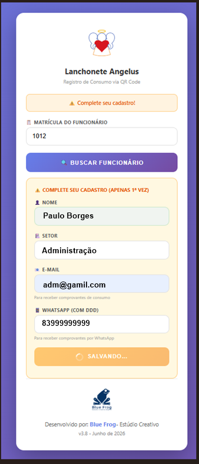
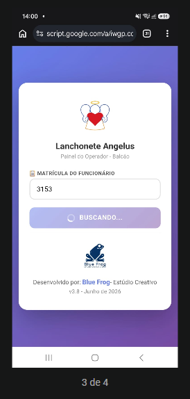
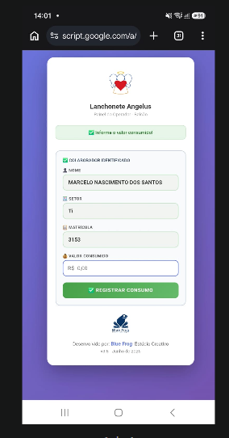
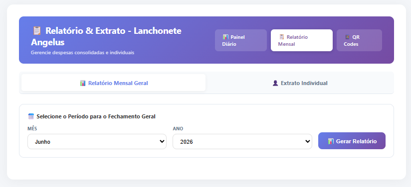
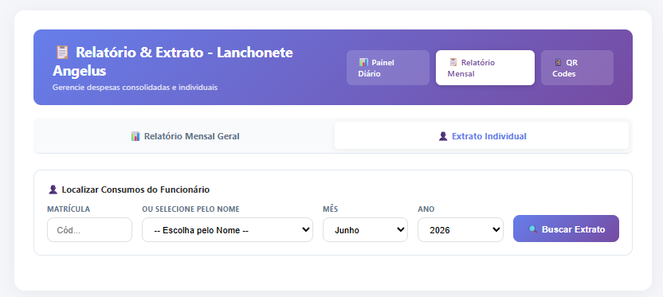
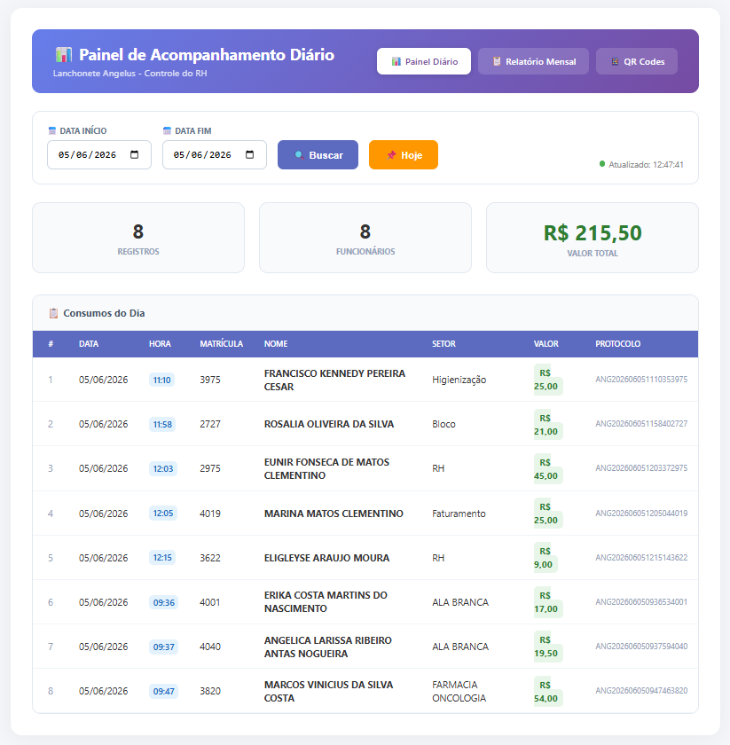
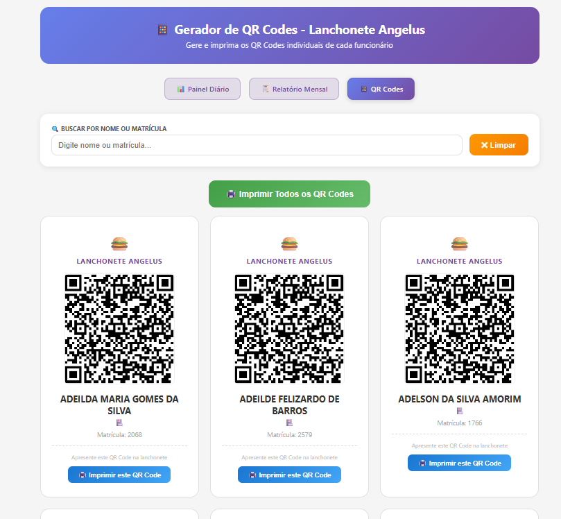

# 🍔 Sistema de Controle de Consumo - Lanchonete Angelus Café

### Solução completa e blindada com QR Code para controle de consumo de funcionários em lanchonetes hospitalares

---

**🐸 Uma Solução Blue Frog Technology**

---

## 📋 Índice

- [Sobre o Projeto](#-sobre-o-projeto)
- [Galeria Visual do Sistema](#-galeria-visual-do-sistema)
- [Problema Resolvido](#-problema-resolvido)
- [Funcionalidades](#-funcionalidades)
- [Blindagens da Versão Premium](#-blindagens-da-versão-premium)
- [Tecnologias Utilizadas](#-tecnologias-utilizadas)
- [Como Instalar](#-como-instalar)
- [Estrutura da Planilha](#-estrutura-da-planilha)
- [Solução de Problemas](#-solução-de-problemas)
- [Contribuindo](#-contribuindo)
- [Licença](#-licença)
- [Autor](#-autor)

---

## 📖 Sobre o Projeto

Sistema web completo desenvolvido com **Google Apps Script** para controlar o consumo de funcionários de um hospital em uma lanchonete interna.

O sistema utiliza **QR Codes individuais** para identificação, eliminando **100% dos erros** de preenchimento manual e faturamento. Ele é blindado para desalinhamentos de planilha e oferece comprovantes instantâneos via WhatsApp e E-mail.

---

## 🎯 Problema Resolvido

| ❌ Antes (Google Forms Manual) | ✅ Depois (Sistema Angelus Premium) |
|---|---|
| Funcionário digitava o nome/matrícula errado | Dados automáticos via QR Code individual |
| RH perdia horas corrigindo faturamento desalinhado | Blindagem de colunas: dados sempre alinhados |
| Sem comprovante imediato para o funcionário | Comprovante instantâneo via e-mail e WhatsApp |
| Relatório manual demorado ao final do mês | Relatório automático e em linha em 14 clique |
| Sem controle em tempo real | Painel diário com atualização automática |

---

## ✨ Funcionalidades

O sistema é dividido em duas frentes: **Balcão (Atendente)** e **Administrativo (RH)**.

### 📱 Registro de Consumo (Atendente)
- ✅ Leitura de QR Code do funcionário.
- ✅ Autocadastro na primeira compra (captura Setor, E-mail e WhatsApp).
- ✅ Blindagem de salvamento (sem travamentos na tela).
- ✅ Envio de comprovante por e-mail automático.
- ✅ **WhatsApp Premium:** Botão verde green na tela de sucesso que gera o comprovante localmente, prevenindo erros de API e garantindo entrega.

### 📊 Painel Diário (RH)
- ✅ Acompanhamento em tempo real (atualização automática a cada 60s).
- ✅ Filtro por período.
- ✅ Cards indicativos: Total de Registros, Funcionários Ativos e Valor Acumulado.

### 📋 Relatório Mensal (RH)
- ✅ Visual Premium Horizontal (filtros lado a lado).
- ✅ Relatório consolidado por mês/ano, formatado para impressão direta.

### 👤 Extrato Individual (RH)
- ✅ Busca dupla sincronizada (digite matrícula *ou* selecione nome).
- ✅ Detalhamento dia a dia dos consumos faturados.

### 📱 Gerador de QR Codes
- ✅ Geração automática para todos os funcionários.
- ✅ Impressão individual ou em lote no formato de cartão.

---

## 🛡️ Blindagens da Versão Premium

Esta versão (**v3.8 Premium**) foi desenvolvida para ser resiliente a erros humanos na manutenção da planilha banco de dados.

1.  **Blindagem de Salvamento de Cadastro:** A função de salvamento do servidor (`Code.gs`) foi corrigida para garantir que os dados de autocadastro (setor, e-mail, telefone) sejam gravados nas colunas exatas (`C`, `D`, `E`) da aba `Funcionarios`, prevenindo desalinhamentos no faturamento.
2.  **WhatsApp Premium:** O link do WhatsApp é gerado no frontend do navegador (`index.html`) usando os dados do faturamento atual. Isso impede faturamentos fantasmas e resolve erros `404` que ocorriam na API do servidor.

---

## 📸 Galeria Visual do Sistema

O sistema Blue Frog Technology foi desenvolvido com foco total na Experiência do Usuário (UX/UI), apresentando uma interface limpa, corporativa e totalmente responsiva. Abaixo, apresentamos a jornada visual das principais telas.

### 📱 Experiência Móvel (Flow do Funcionário)

Desenvolvemos o "Flow Mobile-First" para que os funcionários do hospital consigam gerar seus códigos de consumo e realizar autocadastro em segundos, diretamente pelo smartphone.

| 🔄 Autocadastro de Primeira Compra | 🔲 Geração do QR Code de Autorização |
|---|---|
|  |  |
| **UX Premium:** Se for o primeiro acesso, o sistema detecta dados ausentes e abre automaticamente a tela amarela para o colaborador preencher Setor, E-mail e WhatsApp, salvando instantaneamente nas colunas blindadas. | **Blindagem de Dados:** Após o cadastro, o funcionário recebe este QR Code estático. Ao escanear, o atendente abre uma tela exclusiva de balcão já "logada" no faturamento desse colaborador, impedindo erros 404 e desalinhamentos de faturamento. |

💡 <em>Dica: O funcionário é instruído a tirar um print desta tela para usar sempre, acelerando o atendimento na lanchonete!</em>

### 🍔 Experiência de Balcão (Flow do Atendente)

A interface de balcão foi desenhada para a máxima velocidade. O atendente não digita nada; o sistema lê o QR Code e preenche os dados, aguardando apenas o valor do consumo.

| 🔍 Bipando e Buscando Matrícula | ✅ Colaborador Identificado |
|---|---|
|  |  |
| **Segurança Ativa:** A tela aguarda a leitura. Se a matrícula for inválida, uma mensagem de erro é exibida. Se válida, o sistema passa para a próxima etapa sem looping. | **Faturamento Blindado:** Nome, Matrícula e Setor são preenchidos automaticamente. O atendente digita apenas o valor e clica em **✅ Registrar Consumo**. |

### 📊 Experiência Administrativa (Painel do RH)

Redesenhamos toda a experiência administrativa para que o RH tenha acompanhamento em tempo real e possa emitir relatórios consolidados em linha, sem precisar baixar arquivos extras.

#### 🏢 Relatório Mensal Geral (v3.8 Premium Horizontal)

> **Inovação de UX:** Alinhamos os filtros (Mês, Ano) na horizontal para aproveitar melhor o espaço da tela corporativa. O RH seleciona o período e clica em **📊 Gerar Relatório** para ver o consolidado de todos os funcionários em linha, pronto para impressão em 1 clique.

#### 👤 Extrato Individual (Sincronização Dupla)

> **Segurança:** O RH pode buscar o extrato digitando a matrícula **ou** selecionando o nome na lista lateral. Os dois campos se sincronizam automaticamente, garantindo que o relatório seja sempre do funcionário correto.

#### 📈 Painel Diário em Tempo Real

> **Visibilidade:** O painel diário se atualiza automaticamente a cada 60 segundos, exibindo os consumos do dia com Data, Hora, Nome e o Protocolo Único irrepetível. O RH tem o controle total do faturamento em tempo real.

#### 🔲 Geração e Impressão de QR Codes

> **Produção:** O RH pode gerar QR Codes para todos os funcionários ativos ou buscar um individualmente. O layout é formatado como cartão corporativo para impressão e inserção em crachás.

---

## 🛠️ Tecnologias Utilizadas

| Tecnologia | Uso |
|------------|-----|
| **Google Apps Script** | Backend (motor do servidor e APIs) |
| **Google Sheets** | Banco de dados (Planilha) |
| **HTML5 / CSS3** | Interface do usuário e Design Corporativo |
| **JavaScript** | Lógica do frontend e processamento local |
| **Gmail API** | Envio de e-mails de comprovante |
| **QR Server API** | Geração dinâmica de QR Codes de acesso |
| **WhatsApp Web API** | Geração local de links de comprovante |

---

## 🚀 Como Instalar

### Pré-requisitos
- Conta Google (Gmail)
- Acesso ao Google Sheets e Google Apps Script

### Passo 1: Criar a Planilha

1. Acesse o [Google Sheets](https://sheets.google.com).
2. Crie uma nova planilha vazia chamada **"Sistema Angelus - Lanchonete"**.
3. Crie as abas `Funcionarios` e `Registros` com as estruturas exatas definidas na seção [Estrutura da Planilha](#-estrutura-da-planilha).

> 📖 Veja o guia completo de configuração da planilha em [docs/ESTRUTURA-PLANILHA.md](docs/ESTRUTURA-PLANILHA.md).

### Passo 2: Criar o Apps Script

1. Na planilha, vá em **Extensões → Apps Script**.
2. No painel do script, crie 4 arquivos HTML e 1 arquivo de script (`.gs`) com os nomes exatos correspondentes aos arquivos da pasta `src/` deste repositório.
3. Copie e cole o conteúdo de cada arquivo `src/` para o seu Apps Script.

### Passo 3: Autorizar e Publicar

1. No Apps Script, selecione a função `doGet` no topo e clique em **▶ Executar**. Siga os passos de autorização do Google.
2. Clique no botão azul **Implantar → Nova implantação**.
3. Tipo: **App da Web**.
4. Executar como: **Eu (Sua conta)** | Acesso: **Qualquer pessoa (Anyone)**.
5. Clique em **Implantar** e copie a **URL do App da Web** gerada.

### Passo 4: Atualizar os Links de Navegação (Passo Crítico)

Para que os botões de menu (Painel, Relatório, QR Codes) funcionem, você precisa atualizar a variável que contém a URL do seu sistema nos arquivos HTML.

1.  Abra os arquivos `index.html`, `painel.html`, `relatorio.html` e `qrcodes.html`.
2.  No topo do código JavaScript, localize a variável (geralmente `var URL_SISTEMA`) e substitua pelo link que você copiou no Passo 3.

> 📖 Veja o checklist completo de implantação em [docs/CHECKLIST.md](docs/CHECKLIST.md).

---

## 🗄️ Estrutura da Planilha

O sistema depende da estrutura exata das abas e colunas para funcionar.

### Aba: `Funcionarios` (Banco de Dados do RH)
| Coluna A (1) | Coluna B (2) | Coluna C (3) | Coluna D (4) | Coluna E (5) |
|---|---|---|---|---|
| **Matrícula** | **Nome** | **Setor** | **Email** | **Telefone** |
| 1001 | Maria Silva | Enfermagem | maria@hospital.com | 83988024149 |

* *Os campos Setor, Email e Telefone podem ser preenchidos manualmente pelo RH ou serão preenchidos pelo autocadastro do funcionário na lanchonete.*

### Aba: `Registros` (Histórico de Consumo)
| Coluna A (1) | Coluna B (2) | Coluna C (3) | Coluna D (4) | Coluna E (5) | Coluna F (6) | Coluna G (7) |
|---|---|---|---|---|---|---|
| **Data/Hora** | **Matrícula** | **Nome** | **Setor** | **Protocolo** | **Valor** | **Status** |

---

## 🔧 Solução de Problemas

| Problema | Solução |
|----------|---------|
| Tela de autocadastro não salva e fica em looping | Verifique se a sua aba `Funcionarios` tem exatamente as 5 colunas acima e se você aplicou a correção no `Code.gs v4.4`. |
| Comprovante de WhatsApp dá erro 404 ao abrir | Aplique a blindagem `Premium WhatsApp` no `index.html v3.8` (geração local do link). |
| E-mail de comprovante não chega | Verifique se o e-mail do funcionário está correto na planilha e se você atingiu o limite diário de envio do Gmail. |

---

## 🤝 Contribuindo

Ideias para contribuições futuras:
- [ ] Limite diário de gastos por funcionário.
- [ ] Dashboard com gráficos avançados (Chart.js).
- [ ] Integração com sistema de folha de pagamento.

---

## 👨‍💻 Autor

 

### 🐸 Blue Frog Smart Solutions

⭐ **Se este projeto foi útil para você, deixe uma estrela no repositório!**

